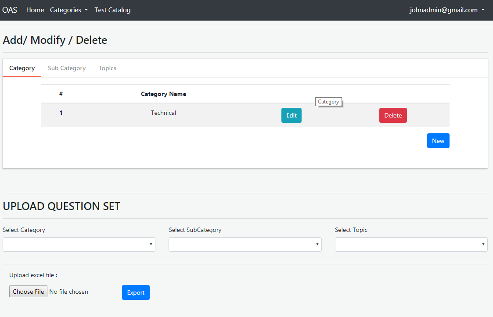
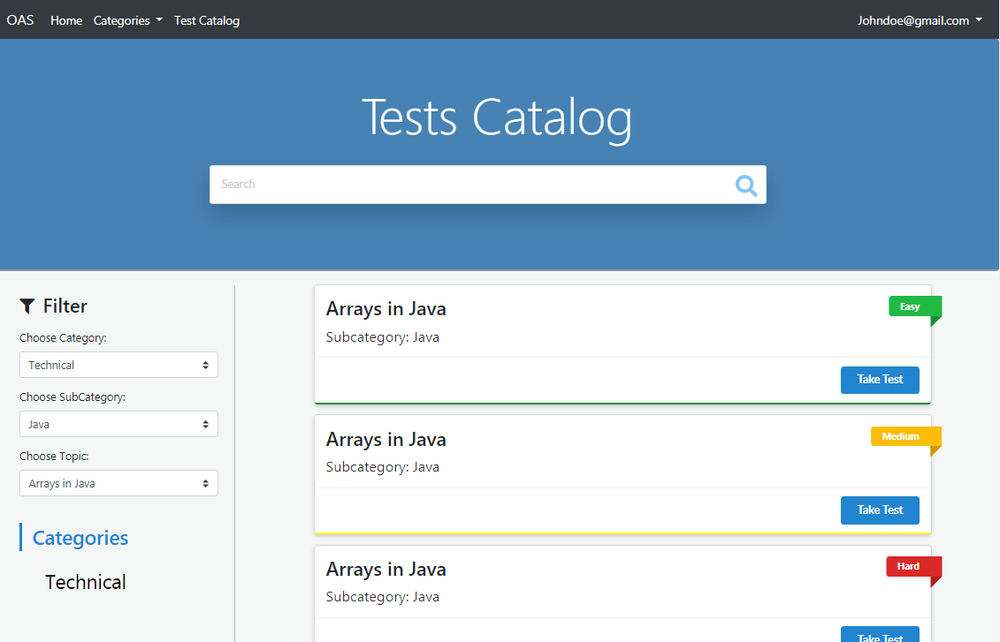

# Online-Assessment-System-.NET-WEB-API-ANGULAR
Minimal assessment System based on .NET framework and Angular 

- Backend 
 .NET WEB API,Layered Architecture, SSMS, UNIT TEST CASES. 

- Front END 
 Angular 4, Responsive Material design, Proper Angular Routing-Modules-Components etc. 

# Screenshots given below. 

Admin Home Page

TestCatlog Page

More screenshots can be found in the sc folder. 
